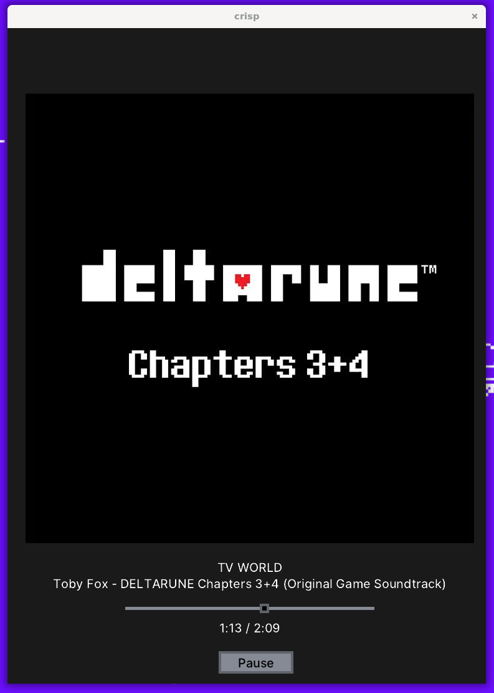

# Crisp (A C++ Music Player GUI App)
[](https://github.com/SirNacho/SE350Project/actions/workflows/build.yml)



- Note: Final submission information will be at the bottom of the readme.md.

# Setup:
- Frontend: Leif
- Programming Language: C and C++

# Requirements:
- Hosts: Linux on X86 (Ubuntu Is Recommended)
- C++ Version: 20
- Project Type: CMake

## Libraries Used (subject to Change):
-  miniaudio
-  glfw
-  leif
-  stb
-  libclipboard
-  cglm

# How to Run:
Install the required dependencies:
Ubuntu:
```
sudo apt-get update && sudo apt-get install -y build-essential cmake libtag1-dev libglfw3-dev libgl1-mesa-dev libglu1-mesa-dev libxrandr-dev libxinerama-dev libxcursor-dev libxi-dev libxext-dev libxkbcommon-dev libasound2-dev libpulse-dev
```

git clone the repo:
```
git clone --recursive https://github.com/SirNacho/SE350Project.git
```
Go to the project directory: 
```
cd SE350Project
```
Make a directory called build:
```
mkdir -p build
```
Go to the build folder:
```
cd build
```
Run cmake first:
```
cmake ..
```
Then build using make:
```
make
```
(optional if you want to test the program) Move the executable to the root of the project:
```
mv crisp ..
```

# Testing the program:
If you want to debug and figure out whether the program can play a music. 
- First, get a mp3 file. Preferable, more than 1 or 2 audio file.
- Then, place the mp3 files to src/assets
- Finally, run the test command:
```
./crisp --test
```

# Usage:
To start the program with default setting:
```
./crisp
```
To start the program on a different directory:
```
./crisp --path {directory}
```
To get the version:
```
./crisp --version
```
To test the program, run the program at the root of the repo and run the command:
```
./crisp --test
```

# To-Do List:
- Figure out a way to handle when the app reach the end of the playlist.
- Implement a TUI (optional)
- Create UI for GUI
- Sketch some pixel art UI for the buttons
- Use a different font for the music player
- Check for memory leaks at the end

# Final Submission Related Info:

## List of Design Patterns Used And Their Location:
- Singleton Pattern (include/audioEngine.h and src/audioEngine.cpp)
- Observer Pattern (src/audioEngine.cpp and src/main.cpp)
- Command Pattern (src/appConfig.cpp)
- Strategy Pattern (include/playBackStrategy.h, include/concreteStrategies.h, and src/main.cpp)

## Any notable list of bugs or anything else:
- There is a slight delay on the pause and play button for the music in some machines.
- There was an issue that I had before where some libraries requires other dependencies that I don't need at the moment like libclipboard.
- Although I picked leif for it's easy and portable GUI implementation, it hasn't been updated in two years and I believe I would need to replace that GUI with something else later on.
